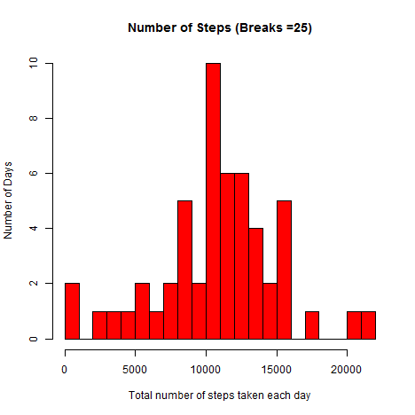
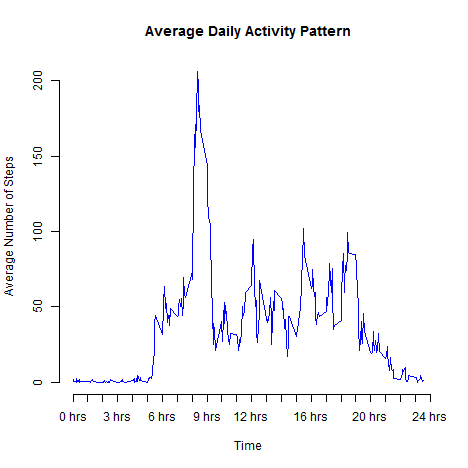
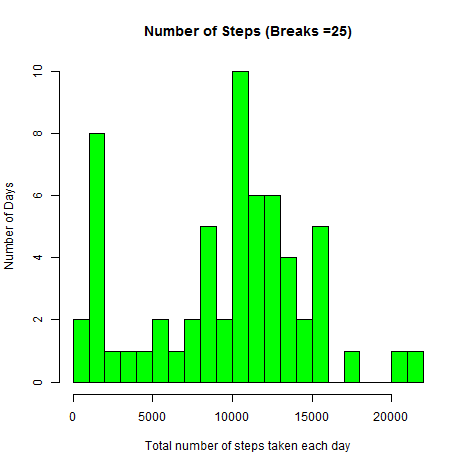
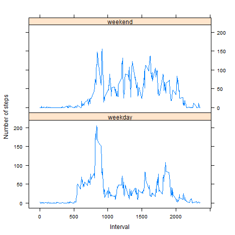

# Reproducible Research: Peer Assessment 1

### Loading and preprocessing the data

##### Loading lattice and plyr libraries

```r
library(lattice)
library(plyr)
```
#### 1. Load the data 


```r
inputFile <- "./activity.csv"
activityWNA <- read.csv(inputFile, sep=",")
```

#### 2. Process/transform the data (if necessary) into a format suitable for your analysis

```r
activityWNA$date <- factor(as.Date(activityWNA$date,"%Y-%m-%d"))
```
#### What is mean total number of steps taken per day?
##### Ignore the missing values in the data.frame


```r
activityWNoNA <- subset(activityWNA,!(activityWNA$steps == "NA" ))
```

##### Create a data.frame by summarizing the data for each day

```r
totalStepsPerDay <- ddply(activityWNoNA, .(date), summarise, steps=sum(steps))
```
#### 1. Make a histogram of the total number of steps taken each day

```r
hist(	totalStepsPerDay$steps, 
		breaks = 25, 
		main="Number of Steps (Breaks =25)",  
		xlab="Total number of steps taken each day", 
		ylab = "Number of Days", 
		col="red")
```

 
#### 2. Calculate and report the mean and median total number of steps taken per day 

```r
(mean<-round(mean(totalStepsPerDay$steps),0))
```

```
## [1] 10766
```

```r
(median<-round(median(totalStepsPerDay$steps),0))
```

```
## [1] 10765
```
The mean and median of total number of steps taken per day are 10766 and 10765 respectively.


### What is the average daily activity pattern?	
##### Calculate the average number of steps  per interval across all the days

```r
meanStepsPerInterval <- ddply(activityWNoNA, .(interval), summarise, steps=mean(steps))
```
#### 1. Make a time series plot (i.e. type = "l") of the 5-minute interval (x-axis) and the average number of steps taken, averaged across all days (y-axis)

```r
plot(meanStepsPerInterval$interval, 
	meanStepsPerInterval$steps,
	axes = FALSE, 
	type="l", 
	col="blue", 
	xlab="Time", 
	ylab="Average Number of Steps",
    main="Average Daily Activity Pattern")
axis(	1,
		at=seq(0,2400,100), 
		label = paste(c(0:24),"hrs"))
axis(2)
```

 
#### 2. Which 5-minute interval, on average across all the days in the dataset, contains the maximum number of steps?
##### Find the interval corresponding to the maximum number of steps

```r
maxInterval <- meanStepsPerInterval[which.max(meanStepsPerInterval$steps), ]
```
##### Create a function to format the interval as military  time for display purpose

```r
formatInterval <- function (x)
	{
	switch(nchar(x),
		paste("0",x," mins",sep=""),
		paste(x," mins",sep=""),
		paste("0",substr(x,0,1),":",substr(x,2,3)," hrs",sep=""),
		paste(substr(x,0,2),":",substr(x,3,4)," hrs",sep="")
		)
	}
		
(timeOfMaxSteps <- formatInterval(maxInterval$interval))
```

```
## [1] "08:35 hrs"
```
The maximum number of steps corresponds to the interval starting at 08:35 hrs.

### Imputing missing values

```r
imputed <- activityWNA
```
#### 1. Calculate and report the total number of missing values in the dataset (i.e. the total number of rows with NAs)

```r
(missingValues <-sum(is.na(activityWNA$steps)))
```

```
## [1] 2304
```
Total number of missing values in the dataset is 2304.
#### 2. Devise a strategy for filling in all of the missing values in the dataset. The strategy does not need to be sophisticated. For example, you could use the mean/median for that day, or the mean for that 5-minute interval, etc.
##### Strategy:  Substitue the missing values with the median of each interval.

```r
medianStepsPerInterval <- ddply(activityWNoNA, .(interval), summarise, steps=median(steps))
```
#### 3. Create a new dataset that is equal to the original dataset but with the missing data filled in.

```r
for (i in 1:nrow(activityWNA)){
    if (is.na(imputed$steps[i])){
        imputed$steps[i] <- medianStepsPerInterval$steps[which(imputed$interval[i] 
			== medianStepsPerInterval$interval)]}
}
imputed <- arrange(imputed, interval)
```

#### 4. Make a histogram of the total number of steps taken each day and Calculate and report the mean and median total number of steps taken per day. Do these values differ from the estimates from the first part of the assignment? What is the impact of imputing missing data on the estimates of the total daily number of steps?

```r
totalStepsPerDayImputed <- ddply(imputed, .(date), summarise, steps=sum(steps))
hist(	totalStepsPerDayImputed$steps, 
		breaks = 25, 
		main="Number of Steps (Breaks =25)",  
		xlab="Total number of steps taken each day", 
		ylab = "Number of Days", 
		col="green")
```

 

```r
(meanImputed <- round(mean(totalStepsPerDayImputed$steps)))
```

```
## [1] 9504
```

```r
(medianImputed <- round(median(totalStepsPerDayImputed$steps)))
```

```
## [1] 10395
```
The mean and median of total number of steps taken per day of imputed dataset are 9504 and 10395 respectively.


```r
(meanDiff <- abs(mean-meanImputed)/mean)
```

```
## [1] 0.1172209
```

```r
(medianDiff <- abs(median-medianImputed)/median)
```

```
## [1] 0.03437065
```
The impact of imputing missing data on the estimates of the total daily number of steps:- 
	Mean:  0.117221 
	Median: 0.034371

	
### Are there differences in activity patterns between weekdays and weekends?
#### 1. Create a new factor variable in the dataset with two levels - "weekday" and "weekend" indicating whether a given date is a weekday or weekend day.
	

##### Create the new weekday/weekend factor

```r
imputed$weekOrWeekend <- ifelse(weekdays(as.Date(imputed$date))
			%in% c("Saturday", "Sunday"),"weekend", "weekday")
```
##### Summarize the data for the new weekday/weekend factor

```r
totalStepsPerWeekOrWeekend <- ddply(imputed, .(interval, weekOrWeekend), summarise, steps=mean(steps))
```
#### 2. Make a panel plot containing a time series plot (i.e. type = "l") of the 5-minute interval (x-axis) and the average number of steps taken, averaged across all weekday days or weekend days (y-axis). 

```r
xyplot(steps ~ interval | weekOrWeekend, 
		data = totalStepsPerWeekOrWeekend, 
		layout = c(1, 2), type="l", 
		xlab = "Interval", 
		ylab = "Number of steps")
```

 


		
	 
